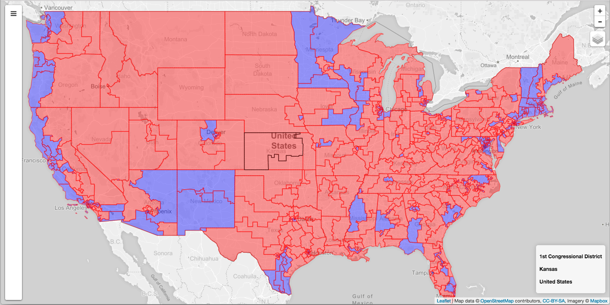

# Politics Map

Web frontend for an interactive map of the representation of the US federal government. See [politics-map-backend](https://github.com/felixtan/politics-map-backend) for the backend.

[Demo](https://politics-map.herokuapp.com/)



##Install
```
npm install
```
##Config
- Create a `config` directory in `app/`
- Create file `mongo.json` in `app/config/` which exports a mongodb connection string via property `uri`. This is the database which stores the representatives and elections data.
```javascript
{
  uri: "mongodb://<username>:<password>@<host>:<port>/<dbname>"
}
```
- Create a file `devApi.json` in `app/config/` which exports the API endpoints for the representatives and elections data.
```javascript
{
  "representatives": "http://localhost:8000/api/representatives/",
  "elections": "http://localhost:8000/api/elections/"
}
```
- Create a file `mapbox.json` in `app/config/`. You will need a free access token from [mapbox](https://www.mapbox.com/studio/signup/?path=%2Faccount%2Ftokens%2F).
```
{
  "url": "https://api.tiles.mapbox.com/v4/{id}/{z}/{x}/{y}.png",
  "APIkey": "<access token>",
  "attribution": "Map data © OpenStreetMap contributors, CC-BY-SA, Imagery © Mapbox",
  "id": "mapbox.light"
}
```

##Running the development server
1. Make sure the backend server is running.
2. Call `npm run dev`

##Running the production server
1. Make sure the backend server is running.
2. `npm run build`
3. `npm start`
